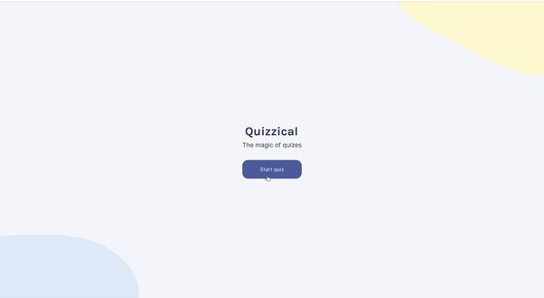

# React Trivia Game Project

## Description
This project was developed as a challenge from the Basic React course on Scrimba. The challenge was to create a Trivia game using the Open Trivia DB API where the user is presented with 5 trivia questions with 2 to 4 answers each. The user must select the answers and click the "Check answers" button, which will show the correct and wrong answers and the user's score. After checking the answers, the user is presented with a button to restart the game.

This project was mostly built in React, and it was a great way for me to practice state management with useState and useEffect. I was also able to review API consumption and conditional rendering.

## Screenshots

### Desktop

## Live webpage
https://regal-profiterole-850d5e.netlify.app/
